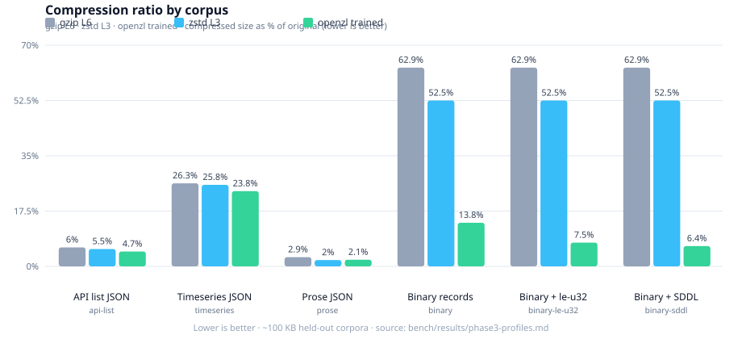
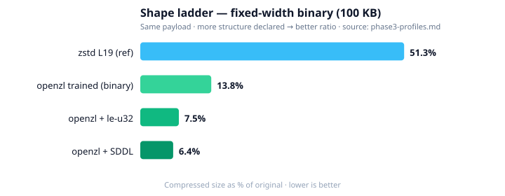
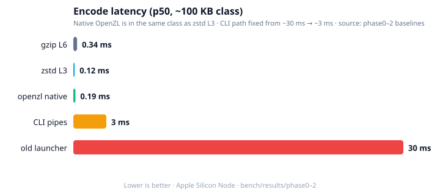

# openzl-express

**Multi-codec HTTP compression for Node** — [OpenZL](https://github.com/facebook/openzl) · **zstd** · **gzip**

[](https://www.npmjs.com/package/openzl-express)
[](package.json)
[](LICENSE)

```bash
npm install openzl-express
```

| | |
|--|--|
| **What it is** | Negotiate `openzl` / `zstd` / `gzip` on Express or Fastify (or use the framework-free core) |
| **What it is not** | A drop-in “always better than gzip” codec for every browser page |
| **Heroes** | **gzip** and **zstd** — the default highway |
| **Specialized lane** | **OpenZL** when data shape is stable and you can **train** |
| **Flagship** | Metrics / time-series JSON · fixed-width binary exports |
| **Version** | `0.4.0` · Series 2 complete (Phases 7–12) |

```
Client Accept-Encoding          Server Content-Encoding
─────────────────────          ──────────────────────
openzl (explicit only)    →    openzl   (trained profile)
zstd                      →    zstd     (Node zlib, when available)
gzip  /  *                →    gzip     (* never selects openzl)
(none)                    →    identity
```

Nothing fails `npm install`. Missing native/CLI → zstd/gzip still work.

---

## Benchmarks (real numbers, charted)

Sources: [`bench/results/phase3-profiles.md`](bench/results/phase3-profiles.md),  
[`phase2-baseline.md`](bench/results/phase2-baseline.md),  
[`phase0-baseline.md`](bench/results/phase0-baseline.md) · ~100 KB held-out corpora · Apple Silicon / Node.

### Compression ratio — gzip vs zstd vs OpenZL (trained)

**Lower % = smaller wire size.** OpenZL wins hardest when structure is declared (binary + training).



| Corpus (~100 KB) | gzip L6 | zstd L3 | **openzl trained** | Profile |
|------------------|--------:|--------:|-------------------:|---------|
| API list JSON | 6.0% | 5.5% | **4.7%** | `api-list` |
| Timeseries JSON | 26.3% | 25.8% | **23.8%** | `timeseries` |
| Prose JSON | 2.9% | **2.0%** | 2.1% | `prose` |
| Binary records | 62.9% | 52.5% | **13.8%** | `binary` |
| Binary + `le-u32` | 62.9% | 52.5% | **7.5%** | `binary-le-u32` |
| Binary + SDDL | 62.9% | 52.5% | **6.4%** | `binary-sddl` |

```mermaid
%%{init: {'theme': 'base', 'themeVariables': { 'xyChart': {'plotColorPalette': '#94a3b8, #38bdf8, #34d399'}}}}%%
xychart-beta
  title "Compressed size (% of original) — lower is better"
  x-axis ["API list", "Timeseries", "Prose", "Binary", "le-u32", "SDDL"]
  y-axis "Ratio %" 0 --> 70
  bar [6.0, 26.3, 2.9, 62.9, 62.9, 62.9]
  bar [5.5, 25.8, 2.0, 52.5, 52.5, 52.5]
  bar [4.7, 23.8, 2.1, 13.8, 7.5, 6.4]
```



> Bars: **gray = gzip L6** · **blue = zstd L3** · **green = openzl trained**

### Shape ladder — same binary payload, more structure



| What we told the compressor | Ratio |
|-----------------------------|------:|
| zstd L19 (reference) | 51.3% |
| OpenZL trained (`binary`) | **13.8%** |
| + little-endian u32 base | **7.5%** |
| + exact 16-byte SDDL layout | **6.4%** (~**8×** smaller than zstd L19) |

### Encode latency — backends



| Backend | Encode p50 (~100 KB) | Notes |
|---------|---------------------:|--------|
| **Native N-API** | **~0.1–0.4 ms** | Same class as zstd L3 |
| zstd L3 | ~0.1 ms | Node zlib when available |
| gzip L6 | ~0.3–1.5 ms | Always available |
| CLI `zli` pipes | ~2–4 ms | Phase 1 |
| Old Node launcher + temp files | ~30 ms | Phase 0 (fixed) |

**Takeaway:** train on your shape. Binary/typed data is where OpenZL earns its name. Prose is competitive with zstd, not magic. Browsers should stay on gzip/zstd ([`docs/BROWSER.md`](docs/BROWSER.md)).

Reproduce:

```bash
npm run bench          # full matrix → bench/results/
npm run bench:quick
npm run demo:flagship  # live metrics compare on http://127.0.0.1:3456/
```

---

## Where we are (Series 2)

| Phase | Status | What landed |
|------:|:------:|-------------|
| 0–6 | done | Bench, native, profiles, WASM, Express coverage, ship chain |
| 7 | done | Multi-codec negotiate: openzl · **zstd** · gzip |
| 8 | done | Package surfaces: `/core` · `/express` · `/fastify` |
| 9 | done* | Release hygiene, pack smoke, install never fails |
| 10 | done | Browser **demoted** to experimental |
| 11 | done | Decompress limits, structured errors, `onCompress`, goldens |
| 12 | done | Flagship metrics story, `openzl-train`, community docs |

\* Tag **`v0.4.0`** on GitHub to activate published native prebuilds for all CI platforms.

---

## Quick start

### Express

```ts
import express from 'express';
import { openzlMiddleware } from 'openzl-express/express';

const app = express();
app.use(openzlMiddleware({
  threshold: 1024,
  profile: 'timeseries', // or 'api-list' | 'binary' | path to .zlc
  // selectProfile: (req) =>
  //   req.path.startsWith('/metrics') ? 'timeseries' : 'api-list',
  fallbackToGzip: true,
  preferStreamGzip: true,
  onCompress: ({ encoding, ratio, ms, bytesIn, bytesOut }) => {
    // wire to your metrics backend
  },
}));

app.get('/api/metrics', (_req, res) => {
  res.json({ /* sensor points … */ });
});

app.listen(3000);
```

### Fastify

```ts
import Fastify from 'fastify';
import { openzlFastify } from 'openzl-express/fastify';

const app = Fastify();
await app.register(openzlFastify, {
  threshold: 1024,
  profile: 'timeseries',
});
app.get('/api/metrics', async () => ({ points: [] }));
await app.listen({ port: 3000 });
```

### Core only (no framework)

```ts
import {
  compress,
  decompress,
  pickEncoding,
  compressBody,
  getActiveBackend,
} from 'openzl-express/core';

pickEncoding('openzl, zstd, gzip'); // 'openzl'

const zl = await compress(Buffer.from(JSON.stringify(payload)), {
  profile: 'timeseries',
});
const raw = await decompress(zl, {
  maxInputBytes: 64 * 1024 * 1024,
  maxOutputBytes: 256 * 1024 * 1024,
  timeoutMs: 30_000,
});

console.log(await getActiveBackend()); // 'native' | 'pool' | 'cli-pipe'
```

### Node client

```ts
import { decompress } from 'openzl-express';

const res = await fetch(url, {
  headers: { 'Accept-Encoding': 'openzl, zstd, gzip' },
});
let buf = Buffer.from(await res.arrayBuffer());
const ce = res.headers.get('content-encoding');
if (ce === 'openzl') buf = await decompress(buf);
// else: fetch / undici may already decode gzip/zstd
```

### Train on *your* payloads

```bash
# Drop 10–20 real response bodies into ./samples/
npx openzl-train ./samples -o ./profiles/my-metrics.zlc -p serial --max-time 40
```

```ts
openzlMiddleware({ profile: './profiles/my-metrics.zlc' });
```

### Live flagship demo

```bash
npm run demo:flagship
# → http://127.0.0.1:3456/   size table + /api/compare
# → curl -H 'Accept-Encoding: openzl' -D- http://127.0.0.1:3456/api/metrics -o /dev/null
```

More: [`docs/FLAGSHIP.md`](docs/FLAGSHIP.md) · [`examples/flagship-metrics/`](examples/flagship-metrics/)

---

## Negotiation rules

| Client `Accept-Encoding` | Server chooses |
|--------------------------|----------------|
| `openzl` (must be explicit) | `openzl` |
| `zstd` (Node zlib zstd) | `zstd` |
| `gzip` or `*` | `gzip` (`*` ≠ openzl, ≠ zstd by default) |
| `openzl, zstd, gzip` | prefers **openzl** → zstd → gzip |
| none | identity |

Browsers never get OpenZL by accident — they don’t send `openzl`.

| Express coverage | |
|------------------|--|
| `res.json` / `res.send` / multi-chunk `write` / `sendFile` | via `write`/`end` hooks |
| gzip / zstd | streaming when available (TTFB) |
| openzl | full-body buffer then compress |

---

## Trust (security & observability)

```ts
import { decompress, LimitError, openzlMiddleware } from 'openzl-express';

try {
  await decompress(frame, {
    maxInputBytes: 64 << 20,   // default 64 MiB
    maxOutputBytes: 256 << 20, // default 256 MiB
    timeoutMs: 30_000,
  });
} catch (e) {
  if (e instanceof LimitError) {
    // e.code: INPUT_TOO_LARGE | OUTPUT_TOO_LARGE | TIMEOUT
  }
}

app.use(openzlMiddleware({
  onCompress: (m) => {
    // m: { encoding, ratio, ms, bytesIn, bytesOut, profile?, fallbackFrom? }
  },
}));
```

| Error class | Typical `code` |
|-------------|----------------|
| `OpenZLCLINotFoundError` | `CLI_NOT_FOUND` |
| `CompressionError` | `COMPRESSION_FAILED` |
| `DecompressionError` | `DECOMPRESSION_FAILED`, `INVALID_FRAME` |
| `LimitError` | `INPUT_TOO_LARGE`, `OUTPUT_TOO_LARGE`, `TIMEOUT` |

Details: [`docs/COMPAT.md`](docs/COMPAT.md)

---

## Tests & quality gates

All of these are meant to be **runnable and green** on a normal dev machine (native optional; gzip always).

| Command | What it proves |
|---------|----------------|
| **`npm test`** | Build + Express negotiate/smoke + Fastify smoke + **trust** suite |
| `npm run test:trust` | Limits, malformed frames (no crash), goldens roundtrip, `onCompress` |
| `npm run demo:flagship` | Live openzl vs gzip vs zstd on metrics JSON |
| `npm run bench` / `bench:quick` | Full codec matrix → `bench/results/` |
| `npm run release:check` | Pre-publish surface check |
| `npm run pack:smoke` | Pack tarball + install in a temp dir |

```bash
npm test
# Express: json/send/stream/sendFile · gzip · zstd · openzl · pickEncoding
# Fastify: onSend compression paths
# Trust: 15 cases — limits, malformed, metrics, interop goldens
```

Goldens: `test/fixtures/goldens/` · harness: `scripts/test-trust.mjs`, `test-middleware.mjs`, `test-fastify.mjs`.

---

## Package layout

```
openzl-express          # root (back-compat re-exports)
openzl-express/core     # framework-free
openzl-express/express  # Express middleware
openzl-express/fastify  # Fastify plugin
openzl-express/browser  # experimental WASM decode (warns once)
```

| Layer | Platforms (CI) | If missing |
|-------|----------------|------------|
| `@amirja811/openzl-cli` (`zli`) | darwin/linux/win prebuilds | zstd/gzip still work |
| Native N-API | release assets after `v*` tag | CLI → zstd/gzip |
| Browser WASM | ship `browser/dist` or `build:wasm` | **use gzip** |

| Feature | Node |
|---------|------|
| Install, gzip, adapters | **≥ 18** |
| **zstd** via `zlib` | typically **≥ 22.15** (auto-skipped if missing) |

### Install env knobs

| Variable | Effect |
|----------|--------|
| `OPENZL_SKIP_NATIVE=1` | Skip native download in postinstall |
| `OPENZL_NATIVE=0` | Runtime ignores native addon |
| `OPENZL_POOL_SIZE=0` | Disable CLI worker pool |
| `OPENZL_NATIVE_URL` | Override prebuild URL |
| `OPENZL_DEBUG=1` | Fallback path logs |

---

## Middleware options

| Option | Default | Description |
|--------|---------|-------------|
| `enabled` | `true` | Master switch |
| `threshold` | `1024` | Min body bytes to compress |
| `fallbackToGzip` | `true` | On OpenZL failure |
| `profile` | `'serial'` | Shipped name, builtin, or `.zlc` path |
| `selectProfile` | — | Per-request profile |
| `allowZstd` | auto | Disable zstd negotiate |
| `preferStreamGzip` | `true` | Prefer stream codecs for `sendFile` |
| `filter` | compressible types | `(req, res) => boolean` |
| `onCompress` | — | Metrics hook |
| `onError` | — | Error hook |
| `debug` | `false` | Logs |

Shipped profiles: `serial`, `timeseries`, `api-list`, `prose`, `binary`, `binary-le-u32`, `binary-sddl` — see `profiles/manifest.json`.

---

## Browser (experimental)

| | |
|--|--:|
| Status | **Not primary** — demoted Phase 10 |
| `openzl_decode.wasm` | **~1.3 MB** (wasm64) |
| Decode p50 (~29 KB JSON) | **~0.04 ms** |
| Break-even vs gzip (transfer) | ~**1.6k** similar responses / session |

Default clients = **Node + gzip/zstd**. Only send `openzl` to the browser if you control both ends and amortization is measured.  
→ [`docs/BROWSER.md`](docs/BROWSER.md) · [`browser/README.md`](browser/README.md)

---

## Scripts

| Script | Purpose |
|--------|---------|
| `npm test` | Middleware + Fastify + trust |
| `npm run demo:flagship` | Metrics comparison demo |
| `npm run bench` | Codec matrix benchmarks |
| `npx openzl-train …` | Train a custom `.zlc` |
| `npm run train:profiles` | Regenerate shipped profiles |
| `npm run build:native` | Local N-API addon |
| `npm run build:wasm` | Browser decoder |
| `npm run release:check` | Preflight before tag |
| `npm run pack:smoke` | Pack + install smoke |

---

## Docs map

| Doc | Topic |
|-----|--------|
| [`docs/FLAGSHIP.md`](docs/FLAGSHIP.md) | Why metrics / timeseries |
| [`docs/COMPAT.md`](docs/COMPAT.md) | Frame versions, limits, errors |
| [`docs/BROWSER.md`](docs/BROWSER.md) | Why browser is experimental |
| [`docs/RELEASE.md`](docs/RELEASE.md) | Tag & prebuild checklist |
| [`docs/charts/`](docs/charts/) | SVG charts used above |
| [`ROADMAP.md`](ROADMAP.md) | Full phase history |
| [`CONTRIBUTING.md`](CONTRIBUTING.md) | Principles & PR guide |

---

## Troubleshooting

| Symptom | Likely cause |
|---------|----------------|
| Always gzip | No `Accept-Encoding: openzl`, or no native/CLI |
| `X-OpenZL-Error` | OpenZL failed; fallback codec used |
| No compression | Below `threshold` or identity |
| No zstd | Node build without zlib zstd → auto-skipped |
| WASM won’t load | Need **wasm64**; fall back to gzip |
| Native missing after install | No release prebuild for platform yet; CLI still works |

---

## Related

- [OpenZL](https://github.com/facebook/openzl) (Meta)
- [`@amirja811/openzl-cli`](https://www.npmjs.com/package/@amirja811/openzl-cli) — prebuilt `zli`

## Disclaimer

Unofficial community package. Not affiliated with Meta.

## License

MIT
